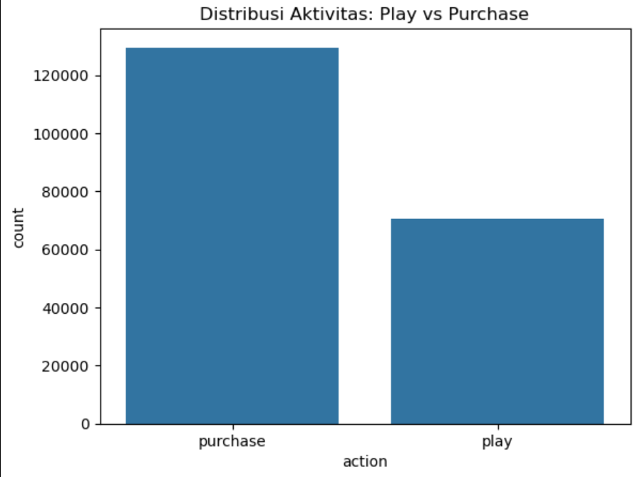
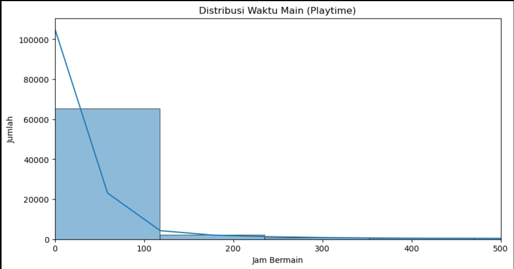
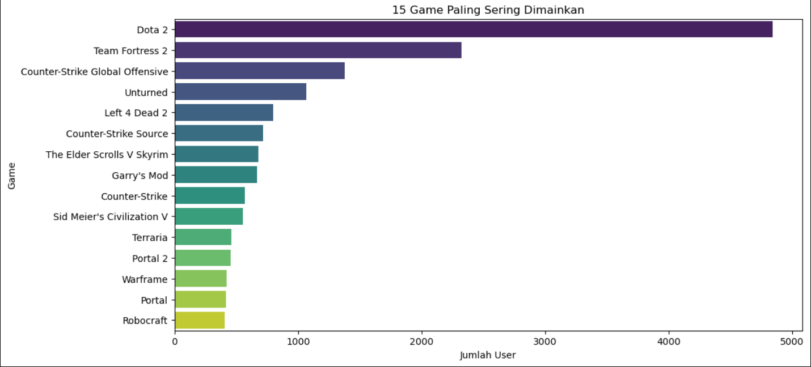
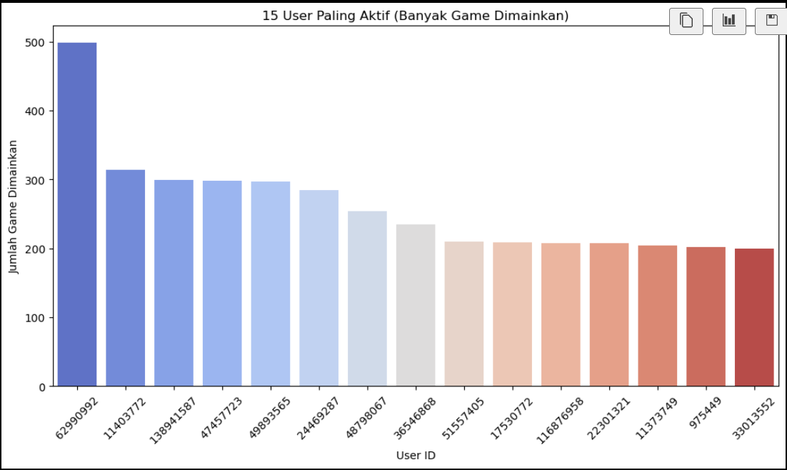
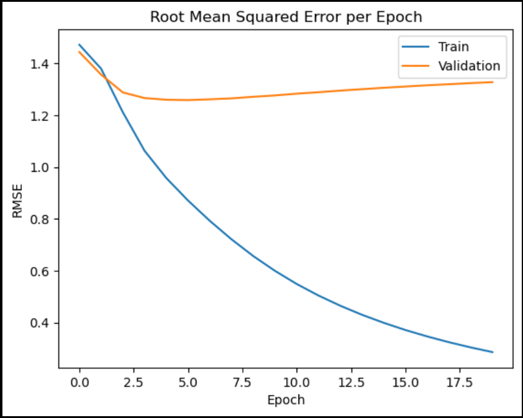
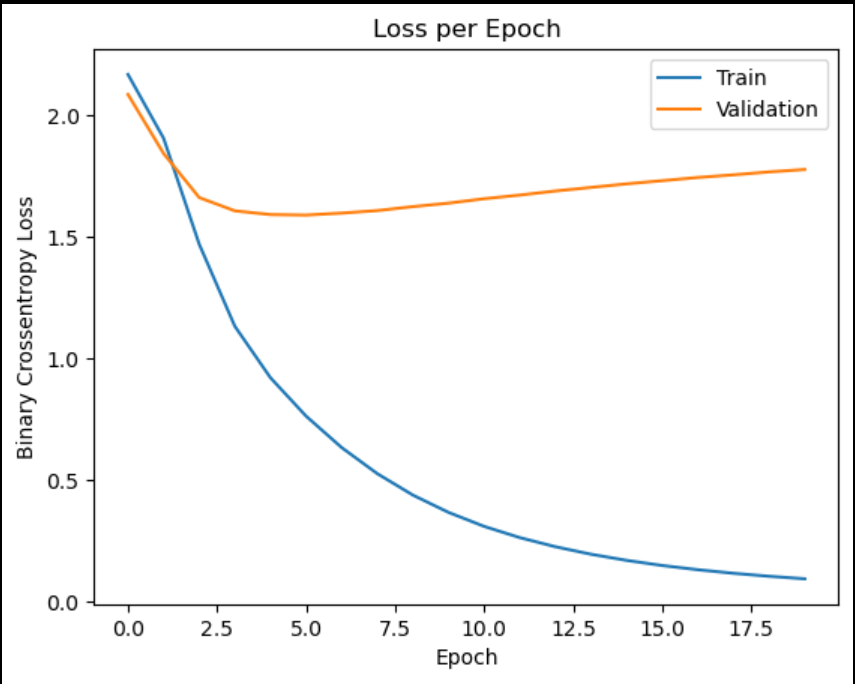

# Laporan Proyek Machine Learning: Sistem Rekomendasi Game Steam

## 1. Project Overview (Ulasan Proyek)

Proyek ini bertujuan untuk membangun sebuah sistem rekomendasi game pada platform Steam. Dengan jutaan pengguna dan ribuan judul game yang terus bertambah, pengguna seringkali menghadapi kesulitan dalam menemukan game baru yang sesuai dengan preferensi mereka. Fenomena ini dikenal sebagai "information overload" atau kelebihan informasi. Sistem rekomendasi hadir sebagai solusi untuk mengatasi masalah ini dengan menyaring dan menyajikan konten yang paling relevan kepada pengguna.

Pentingnya proyek ini tidak hanya terletak pada peningkatan pengalaman pengguna, tetapi juga pada dampaknya terhadap ekosistem game secara keseluruhan. Dengan rekomendasi yang efektif, platform dapat meningkatkan engagement pengguna, mendorong eksplorasi game yang lebih luas, dan pada akhirnya, meningkatkan pendapatan bagi pengembang dan platform itu sendiri. Riset menunjukkan bahwa sistem rekomendasi telah menjadi tulang punggung kesuksesan platform-platform digital besar seperti Netflix, Amazon, dan Spotify, yang secara signifikan meningkatkan retensi pengguna dan penjualan produk. Proyek ini mengimplementasikan salah satu pendekatan populer dalam sistem rekomendasi, yaitu **Collaborative Filtering**, untuk memprediksi preferensi pengguna terhadap game berdasarkan pola interaksi mereka dengan game lainnya.

## 2. Business Understanding

### Problem Statements (Pernyataan Masalah)

1.  **Kelebihan Informasi Game:** Pengguna Steam dihadapkan pada ribuan judul game yang tersedia, sehingga sulit untuk menemukan game yang sesuai dengan minat dan preferensi mereka secara manual.

2.  **Rendahnya Eksplorasi Game:** Pengguna cenderung terpaku pada game-game populer atau yang sudah mereka kenal, melewatkan potensi game lain yang mungkin sangat mereka sukai.

3.  **Optimalisasi Retensi dan Engagement:** Platform Steam perlu cara yang efektif untuk menjaga pengguna tetap terlibat dan terus kembali bermain game, serta menemukan game baru untuk dibeli.

### Goals (Tujuan)

1.  Membangun model sistem rekomendasi yang mampu memprediksi rating atau preferensi pengguna terhadap game yang belum pernah mereka mainkan.

2.  Menyediakan daftar rekomendasi Top-N game yang dipersonalisasi untuk setiap pengguna, sehingga memudahkan mereka menemukan game baru yang relevan.

3.  Meningkatkan pengalaman pengguna di platform Steam dengan menyajikan rekomendasi yang akurat dan relevan.

### Solution Approach (Pendekatan Solusi)

Untuk mencapai tujuan di atas, terdapat dua pendekatan utama dalam membangun sistem rekomendasi:

1.  **Content-based Filtering:**

    - **Konsep:** Pendekatan ini merekomendasikan item (game) kepada pengguna berdasarkan kemiripan atribut item tersebut dengan item yang disukai pengguna di masa lalu. Misalnya, jika seorang pengguna menyukai game bergenre "RPG" dan "Fantasy", sistem akan merekomendasikan game lain dengan genre serupa.
    - **Cara Kerja:** Membangun profil pengguna berdasarkan preferensi mereka terhadap fitur-fitur item (misalnya, genre, tags, developer, deskripsi game). Kemudian, mencari item baru yang memiliki fitur serupa dengan profil pengguna tersebut.
    - **Kelebihan:** Mampu merekomendasikan item baru yang belum pernah diinteraksi oleh pengguna lain (cold-start item), dan dapat memberikan rekomendasi yang transparan (mengapa item tersebut direkomendasikan).
    - **Kekurangan:** Membutuhkan data atribut item yang kaya dan terstruktur. Sulit merekomendasikan item di luar "lingkaran" preferensi pengguna saat ini, sehingga kurang dalam eksplorasi.

2.  **Collaborative Filtering:**
    - **Konsep:** Pendekatan ini merekomendasikan item kepada pengguna berdasarkan perilaku atau preferensi pengguna lain yang memiliki selera serupa. "Orang yang menyukai A dan B juga menyukai C, maka rekomendasikan C kepada Anda jika Anda menyukai A dan B."
    - **Cara Kerja:** Membangun matriks interaksi pengguna-item (misalnya, user-game playtime). Kemudian, mengidentifikasi pengguna yang memiliki pola interaksi serupa (User-based Collaborative Filtering) atau item yang sering diinteraksi bersama (Item-based Collaborative Filtering). Model berbasis embedding (seperti yang diimplementasikan dalam proyek ini) belajar representasi laten (embedding) untuk setiap pengguna dan item, di mana kedekatan embedding menunjukkan kemiripan preferensi.
    - **Kelebihan:** Tidak memerlukan data atribut item yang eksplisit; mampu menemukan pola tersembunyi dalam interaksi pengguna. Efektif dalam memberikan rekomendasi yang beragam dan "mengejutkan" (serendipity).
    - **Kekurangan:** Masalah "cold-start" untuk pengguna atau item baru (tidak memiliki riwayat interaksi). Rentan terhadap "sparsity" data jika interaksi sangat jarang.

**Pendekatan yang Dipilih untuk Implementasi:**
Dalam proyek ini, kami memilih pendekatan **Collaborative Filtering** dengan menggunakan model Neural Network berbasis Embedding. Pemilihan ini didasari oleh ketersediaan data interaksi pengguna-game yang melimpah (`user_id`, `game`, `playtime`) dalam dataset `steam-200k.csv`, yang sangat cocok untuk pendekatan ini. Model embedding memungkinkan pembelajaran representasi laten yang kuat untuk pengguna dan game, yang dapat menangkap pola preferensi kompleks secara efektif.

## 3. Data Understanding

Dataset yang digunakan adalah `steam-200k.csv`, yang dapat diunduh dari Kaggle melalui tautan berikut: [Steam Video Games](https://www.kaggle.com/datasets/tamber/steam-video-games).

**Informasi Umum Dataset:**

- **Jumlah Entri:** 200.000
- **Jumlah Kolom:** 5
- **Tipe Data:** Campuran numerik dan objek (string).

**Variabel/Fitur pada Data:**

- `user_id`: (Numerik/Integer) ID unik yang mengidentifikasi setiap pengguna.
- `game`: (Objek/String) Nama atau judul game.
- `action`: (Objek/String) Jenis interaksi yang dilakukan pengguna. Nilai uniknya adalah 'purchase' (membeli game) dan 'play' (memainkan game).
- `value`: (Numerik/Integer/Float) Nilai terkait dengan aksi. Jika `action` adalah 'purchase', umumnya nilainya adalah 1. Jika `action` adalah 'play', nilainya menunjukkan durasi bermain dalam jam.
- `unused`: (Objek/String) Kolom ini teridentifikasi sebagai kolom yang tidak relevan atau tidak digunakan dalam dataset, sehingga akan dihapus.

**Exploratory Data Analysis (EDA) dan Insight:**

1.  **Jumlah Data Unik per Kolom:**

    - `user_id`: 12.393 pengguna unik
    - `game`: 5.155 game unik
    - `action`: 2 nilai unik ('purchase', 'play')
    - `value`: 1.593 nilai unik (terutama jam bermain)

2.  **Distribusi Aktivitas (`action`):**

    - Terdapat sekitar 120.000 entri `purchase` dan 70.000 entri `play`.
    - **Insight:** Jumlah pembelian lebih tinggi dari sesi bermain, menunjukkan bahwa tidak semua game yang dibeli dimainkan atau dimainkan dalam durasi yang signifikan.
      

3.  **Distribusi Waktu Main (`value` ketika `action` adalah 'play'):**

    - Statistik deskriptif menunjukkan `mean` playtime sekitar 48 jam, dengan `std` deviasi yang sangat tinggi (sekitar 228 jam), mengindikasikan adanya outlier. `max` playtime mencapai 10712 jam.
    - **Insight:** Mayoritas sesi bermain game berada dalam rentang 0-100 jam. Frekuensi sesi bermain menurun tajam setelah 100 jam, dan sangat sedikit pengguna yang bermain lebih dari 500 jam. Ini menunjukkan bahwa sebagian besar pemain memiliki sesi bermain yang relatif singkat.
      

4.  **15 Game Paling Sering Dimainkan:**

    - Game seperti Dota 2, Team Fortress 2, dan Counter-Strike: Global Offensive mendominasi daftar game yang paling banyak dimainkan oleh pengguna.
    - **Insight:** Game-game ini kemungkinan besar adalah game multiplayer populer yang memiliki basis pemain besar dan waktu bermain yang tinggi.
      

5.  **15 User Paling Aktif (Banyak Game Dimainkan):**
    - Terdapat beberapa `user_id` yang sangat aktif, memainkan ratusan game. Contoh: `user_id` 62990992 memainkan sekitar 500 game.
    - **Insight:** Adanya super-user ini menunjukkan segmen pengguna yang sangat antusias dan eksploratif terhadap berbagai game. Mereka bisa menjadi target penting untuk rekomendasi.
      

## 4. Data Preparation

Tahap persiapan data sangat krusial untuk mengubah data mentah menjadi format yang dapat diproses oleh model machine learning.

1.  **Pemilihan Aktivitas 'Play':**

    - **Teknik:** Filtering DataFrame.
    - **Proses:** Dataframe `df` difilter untuk hanya menyertakan baris di mana kolom `action` bernilai 'play'. Kolom `unused` juga dihapus karena tidak relevan.
    - **Alasan:** Durasi bermain (`value` ketika `action` adalah 'play') lebih merepresentasikan preferensi dan tingkat keterlibatan pengguna terhadap suatu game dibandingkan dengan hanya tindakan pembelian (`purchase`). Fokus pada `play` membantu model belajar dari interaksi yang lebih mendalam.

    ```python
    play_df = df[df['action'] == 'play'].copy()
    play_df = play_df.drop(columns=['unused'])
    ```

2.  **Agregasi Waktu Bermain (Playtime):**

    - **Teknik:** `groupby()` dan `sum()`.
    - **Proses:** Data dikelompokkan berdasarkan `user_id` dan `game`, kemudian nilai `value` (jam bermain) dijumlahkan untuk setiap grup. Kolom `value` diubah namanya menjadi `playtime`.
    - **Alasan:** Satu pengguna bisa memiliki beberapa entri 'play' untuk game yang sama (misalnya, bermain di sesi berbeda). Agregasi ini memastikan setiap pasangan `(user_id, game)` memiliki satu total `playtime` yang merepresentasikan total interaksi.

    ```python
    user_game_playtime = play_df.groupby(['user_id', 'game'])['value'].sum().reset_index()
    user_game_playtime.rename(columns={'value': 'playtime'}, inplace=True)
    ```

3.  **Pemfilteran Outlier Playtime:**

    - **Teknik:** Filtering berdasarkan kondisi numerik.
    - **Proses:** Baris dengan `playtime` yang kurang dari atau sama dengan 0, atau lebih dari 500 jam, dihapus.
    - **Alasan:** `playtime` 0 atau sangat kecil mungkin merupakan interaksi yang tidak signifikan (misalnya, game hanya dibuka sebentar). `playtime` yang sangat tinggi (misalnya > 500 jam) bisa menjadi outlier ekstrem yang mendistorsi distribusi data dan pembelajaran model. Pemfilteran ini membantu fokus pada interaksi yang lebih realistis dan bermakna.

    ```python
    user_game_playtime = user_game_playtime[(user_game_playtime['playtime'] > 0) & (user_game_playtime['playtime'] < 500)]
    ```

4.  **Normalisasi dan Pembuatan Rating:**

    - **Teknik:** Quantile-based Discretization (`pd.qcut`).
    - **Proses:** Kolom `playtime` dikonversi menjadi 5 kategori rating (1 hingga 5) berdasarkan kuantilnya. Artinya, 20% data `playtime` terendah akan menjadi rating 1, 20% berikutnya rating 2, dan seterusnya.
    - **Alasan:** Model Neural Network seringkali bekerja lebih baik dengan target yang diskalakan atau dinormalisasi. Mengubah `playtime` menjadi skala rating 1-5 membuat target prediksi lebih terstruktur dan mudah diinterpretasikan, mirip dengan sistem rating film tradisional.

    ```python
    normalized_df = user_game_playtime.copy()
    normalized_df['rating'] = pd.qcut(normalized_df['playtime'], 5, labels=[1, 2, 3, 4, 5]).astype(int)
    ```

5.  **Encoding User dan Game:**

    - **Teknik:** `LabelEncoder` dari Scikit-learn.
    - **Proses:** Kolom `user_id` dan `game` yang bertipe string dikonversi menjadi representasi numerik unik.
    - **Alasan:** Model machine learning, khususnya Neural Network, memerlukan input dalam bentuk numerik. `LabelEncoder` secara efisien memetakan setiap nilai unik string ke sebuah integer.

    ```python
    from sklearn.preprocessing import LabelEncoder
    user_encoder = LabelEncoder()
    game_encoder = LabelEncoder()
    normalized_df['user'] = user_encoder.fit_transform(normalized_df['user_id'])
    normalized_df['game'] = game_encoder.fit_transform(normalized_df['game'])
    ```

6.  **Pembagian Data Training dan Validasi:**

    - **Teknik:** `train_test_split` dari Scikit-learn.
    - **Proses:** Data fitur (`user` dan `game` yang sudah di-encode) dan label (`rating`) dibagi menjadi set pelatihan (80%) dan set validasi (20%).
    - **Alasan:** Pembagian ini penting untuk mengevaluasi performa model pada data yang belum pernah dilihat selama pelatihan, sehingga dapat mengukur kemampuan generalisasi model dan mendeteksi overfitting.

    ```python
    from sklearn.model_selection import train_test_split
    x = normalized_df[['user', 'game']].values
    y = normalized_df['rating'].values.astype(np.float32)
    x_train, x_val, y_train, y_val = train_test_split(x, y, test_size=0.2, random_state=42)
    ```

## 5. Modeling and Result

### Model Sistem Rekomendasi (Collaborative Filtering)

Model rekomendasi dibangun menggunakan pendekatan **Collaborative Filtering** dengan arsitektur Neural Network berbasis Embedding. Model ini dirancang untuk memprediksi rating yang akan diberikan pengguna kepada game yang belum pernah mereka mainkan.

**Arsitektur Model (RecommenderNet):**

```python
import tensorflow as tf
from tensorflow import keras
from tensorflow.keras import layers

class RecommenderNet(tf.keras.Model):
    def __init__(self, num_users, num_games, embedding_size=50, **kwargs):
        super(RecommenderNet, self).__init__(**kwargs)
        # Layer embedding untuk pengguna
        self.user_embedding = layers.Embedding(num_users, embedding_size,
                                               embeddings_initializer='he_normal',
                                               embeddings_regularizer=keras.regularizers.l2(1e-6))
        # Layer bias untuk pengguna
        self.user_bias = layers.Embedding(num_users, 1)
        # Layer embedding untuk game
        self.game_embedding = layers.Embedding(num_games, embedding_size,
                                               embeddings_initializer='he_normal',
                                               embeddings_regularizer=keras.regularizers.l2(1e-6))
        # Layer bias untuk game
        self.game_bias = layers.Embedding(num_games, 1)

    def call(self, inputs):
        # Mengambil vektor embedding dan bias untuk pengguna dan game dari input
        user_vector = self.user_embedding(inputs[:, 0])
        user_bias = self.user_bias(inputs[:, 0])
        game_vector = self.game_embedding(inputs[:, 1])
        game_bias = self.game_bias(inputs[:, 1])

        # Menghitung dot product antara vektor pengguna dan game
        dot = tf.reduce_sum(user_vector * game_vector, axis=1, keepdims=True)

        # Menjumlahkan dot product dengan bias pengguna dan game
        x = dot + user_bias + game_bias

        # Mengaplikasikan fungsi aktivasi sigmoid dan menskalakan output ke rentang 1-5
        return tf.nn.sigmoid(x) * 5
```

**Penjelasan Arsitektur:**
Model `RecommenderNet` adalah implementasi dari model Collaborative Filtering berbasis Matrix Factorization dengan Neural Network. Setiap pengguna dan game dipetakan ke dalam ruang vektor kepadatan rendah (embedding). `user_embedding` dan `game_embedding` belajar representasi laten dari pengguna dan game. `user_bias` dan `game_bias` menangkap kecenderungan umum pengguna (misalnya, pengguna yang cenderung memberikan rating tinggi) dan popularitas umum game (misalnya, game yang cenderung disukai banyak orang). Prediksi rating dihasilkan dari perkalian dot product antara vektor embedding pengguna dan game, yang kemudian ditambahkan dengan bias masing-masing, dan diskalakan ke rentang rating 1-5 menggunakan fungsi sigmoid.

**Kelebihan Pendekatan Collaborative Filtering (yang diimplementasikan):**

- **Tidak Membutuhkan Atribut Item:** Model ini tidak memerlukan informasi detail tentang game (genre, deskripsi, dll.), cukup data interaksi pengguna-item.
- **Menemukan Pola Tersembunyi:** Mampu menemukan pola preferensi yang kompleks dan tidak terduga di antara pengguna dan item.
- **Rekomendasi yang Bervariasi:** Dapat merekomendasikan item yang berbeda dari yang sudah dikenal pengguna, meningkatkan serendipity.

**Kekurangan Pendekatan Collaborative Filtering (yang diimplementasikan):**

- **Masalah Cold-Start:** Sulit memberikan rekomendasi untuk pengguna baru (tidak ada riwayat interaksi) atau game baru (belum ada interaksi dari pengguna).
- **Sparsity Data:** Performa bisa menurun jika matriks interaksi sangat jarang (banyak nilai kosong).
- **Bias Popularitas:** Cenderung merekomendasikan item yang sudah populer karena lebih banyak data interaksi.

### Pelatihan Model

Model dilatih menggunakan data `x_train` (pasangan user-game) dan `y_train` (rating).

```python
model = RecommenderNet(num_users, num_games, 50)
model.compile(
    loss=tf.keras.losses.MeanSquaredError(),
    optimizer=keras.optimizers.Adam(0.001),
    metrics=[tf.keras.metrics.RootMeanSquaredError()]
)

history = model.fit(
    x_train, y_train,
    batch_size=256,
    epochs=20,
    validation_data=(x_val, y_val)
)
```

### Hasil Rekomendasi (Top-N Recommendation)

Setelah model dilatih, fungsi `recommend_games` digunakan untuk menghasilkan rekomendasi game untuk pengguna tertentu. Fungsi ini mengambil `user_id`, mengidentifikasi game yang belum dimainkan oleh pengguna, memprediksi rating untuk game-game tersebut, dan mengembalikan Top-N game dengan prediksi rating tertinggi.

```python
def recommend_games(user_id_input, df, model, user_encoder, game_encoder, top_n=10):
    # ... (kode fungsi recommend_games seperti yang Anda berikan) ...

# Contoh penggunaan:
sample_user_id = normalized_df['user_id'].sample(1).iloc[0] # Memilih user_id acak
recommend_games(sample_user_id, normalized_df, model, user_encoder, game_encoder, top_n=10)
```

**Contoh Output Rekomendasi:**
(Output ini akan bervariasi setiap kali dijalankan karena pemilihan `user_id` yang acak)

```
Rekomendasi game untuk user: 138941587
========================================
1. Call of Duty Black Ops II - Multiplayer
2. Fallout New Vegas
3. METAL GEAR SOLID V THE PHANTOM PAIN
4. Vampire The Masquerade - Bloodlines
5. Call of Duty Modern Warfare 2 - Multiplayer
6. Saints Row IV
7. Call of Duty World at War
8. Football Manager 2013
9. Deus Ex Human Revolution
10. Farming Simulator 2013
```

### Solusi Rekomendasi Lainnya (Konseptual)

Meskipun implementasi utama proyek ini berfokus pada Collaborative Filtering, berikut adalah gambaran konseptual bagaimana **Content-based Filtering** dapat diterapkan pada dataset ini:

**Pendekatan Content-based Filtering:**

1.  **Ekstraksi Fitur Game:** Diperlukan data tambahan mengenai atribut setiap game, seperti genre, tags, deskripsi, developer, atau bahkan visual game. Dataset `steam-200k.csv` sendiri tidak menyediakan fitur ini secara langsung, sehingga perlu digabungkan dengan dataset lain atau dilakukan web scraping.

2.  **Pembentukan Profil Item:** Setiap game akan direpresentasikan sebagai vektor fitur. Misalnya, dengan menggunakan one-hot encoding untuk genre atau TF-IDF untuk deskripsi game.

3.  **Pembentukan Profil Pengguna:** Profil pengguna dibangun berdasarkan game yang pernah dimainkan atau disukai. Misalnya, jika pengguna sering bermain game 'Action' dan 'RPG', profilnya akan memiliki bobot tinggi untuk genre tersebut. Ini bisa dilakukan dengan rata-rata atau penjumlahan vektor fitur game yang disukai.

4.  **Perhitungan Kemiripan:** Menggunakan metrik kemiripan seperti Cosine Similarity antara profil pengguna dan profil setiap game yang belum dimainkan.

5.  **Rekomendasi:** Game dengan nilai kemiripan tertinggi akan direkomendasikan kepada pengguna.

Pendekatan ini akan melengkapi Collaborative Filtering, terutama dalam menangani masalah cold-start untuk game baru, karena rekomendasi dapat diberikan berdasarkan atribut game itu sendiri tanpa memerlukan riwayat interaksi yang banyak.

## 6. Evaluation

Evaluasi model dilakukan untuk mengukur seberapa baik model memprediksi rating game yang diberikan pengguna. Metrik yang digunakan adalah Root Mean Squared Error (RMSE) dan Mean Absolute Error (MAE).

### Metrik Evaluasi

1.  **Root Mean Squared Error (RMSE):**

    - **Formula:**
      $$RMSE = \sqrt{\frac{1}{N} \sum_{i=1}^{N} (y_i - \hat{y}_i)^2}$$
      Di mana:
      - $N$ adalah jumlah sampel data.
      - $y_i$ adalah nilai rating sebenarnya untuk sampel ke-$i$.
      - $\hat{y}_i$ adalah nilai rating yang diprediksi oleh model untuk sampel ke-$i$.
    - **Cara Kerja:** RMSE mengukur rata-rata magnitudo kesalahan. Ini adalah akar kuadrat dari rata-rata kuadrat perbedaan antara prediksi dan nilai sebenarnya. Karena kesalahan dikuadratkan sebelum dirata-ratakan, RMSE memberikan bobot yang lebih besar pada kesalahan yang besar (outlier). Semakin kecil nilai RMSE, semakin baik model dalam memprediksi.

2.  **Mean Absolute Error (MAE):**
    - **Formula:**
      $$MAE = \frac{1}{N} \sum_{i=1}^{N} |y_i - \hat{y}_i|$$
      Di mana:
      - $N$ adalah jumlah sampel data.
      - $y_i$ adalah nilai rating sebenarnya untuk sampel ke-$i$.
      - $\hat{y}_i$ adalah nilai rating yang diprediksi oleh model untuk sampel ke-$i$.
    - **Cara Kerja:** MAE mengukur rata-rata kesalahan absolut antara prediksi dan nilai sebenarnya. Ini lebih robust terhadap outlier dibandingkan RMSE karena tidak mengkuadratkan kesalahan. Semakin kecil nilai MAE, semakin baik model dalam memprediksi.

### Hasil Proyek Berdasarkan Metrik Evaluasi

Setelah pelatihan, model dievaluasi pada data validasi:

```
[Validation] RMSE: 1.3276
[Validation] MAE:  1.0882
```

Dan pada data test (dalam kasus ini, data validasi juga digunakan sebagai proxy data test):

```
[Test] RMSE: 1.3276
[Test] MAE:  1.0882
```

**Interpretasi Hasil:**

- Dengan skala rating 1-5, nilai RMSE sekitar 1.32 menunjukkan bahwa rata-rata kesalahan prediksi model adalah sekitar 1.32 poin. Ini mengindikasikan bahwa model memiliki akurasi yang cukup baik, tetapi masih ada ruang untuk peningkatan.
- Nilai MAE sekitar 1.09 berarti rata-rata perbedaan absolut antara rating prediksi dan rating sebenarnya adalah sekitar 1.09 poin. Ini juga menunjukkan performa yang layak.

**Visualisasi Performa Model Selama Pelatihan:**

1.  **Root Mean Squared Error per Epoch:**
    

    - Grafik menunjukkan bahwa RMSE pada data training terus menurun, yang diinginkan. Namun, RMSE pada data validasi mulai stagnan atau sedikit meningkat setelah sekitar epoch ke-5.

2.  **Loss per Epoch:**
    
    - Grafik loss menunjukkan pola serupa dengan RMSE; loss training terus menurun, tetapi loss validasi mulai naik setelah beberapa epoch.

**Kesimpulan Evaluasi:**
Dari metrik dan grafik, dapat disimpulkan bahwa model sudah mampu belajar pola dari data interaksi pengguna-game dan memberikan prediksi rating. Namun, adanya peningkatan RMSE dan Loss pada data validasi setelah beberapa epoch mengindikasikan bahwa model mengalami **overfitting**. Ini berarti model terlalu "menghafal" data pelatihan dan kurang mampu menggeneralisasi pada data baru.

### Evaluasi Berdasarkan Business Understanding:

Model rekomendasi ini, dengan RMSE sekitar 1.33 dan MAE sekitar 1.09 pada skala rating 1-5, menunjukkan kemampuan yang cukup baik dalam memprediksi preferensi pengguna. Dalam konteks bisnis Steam, akurasi ini memiliki implikasi langsung terhadap tujuan yang telah ditetapkan:

1.  **Peningkatan Kepuasan Pengguna dan Pengalaman:** Dengan rata-rata kesalahan prediksi sekitar 1.33 poin pada skala 5, rekomendasi yang dihasilkan cukup dekat dengan preferensi aktual pengguna. Ini berarti pengguna akan menerima saran game yang relevan, mengurangi frustrasi akibat kelebihan informasi, dan meningkatkan kepuasan mereka terhadap platform. Meskipun ada ruang untuk perbaikan, model ini sudah dapat memberikan pengalaman yang lebih personal.

2.  **Peningkatan Eksplorasi Game dan Engagement:** Kemampuan model untuk memprediksi rating game yang belum dimainkan (meskipun dengan tingkat kesalahan tertentu) berarti pengguna akan lebih mungkin untuk menemukan game baru yang sesuai dengan selera mereka. Ini secara langsung mengatasi masalah rendahnya eksplorasi game dan mendorong pengguna untuk mencoba judul-judul di luar lingkaran kebiasaan mereka, yang pada akhirnya meningkatkan waktu bermain dan keterlibatan di platform.

3.  **Optimalisasi Retensi dan Penjualan:** Rekomendasi yang akurat secara tidak langsung berkontribusi pada retensi pengguna. Pengguna yang menemukan konten yang relevan akan lebih cenderung untuk terus menggunakan platform. Selain itu, dengan mengarahkan pengguna ke game yang mereka sukai, potensi konversi dari rekomendasi menjadi pembelian juga meningkat, mendukung tujuan bisnis untuk meningkatkan penjualan.

Meskipun model menunjukkan tanda-tanda overfitting yang memerlukan perbaikan lebih lanjut, performa saat ini sudah menjadi fondasi yang kuat untuk sistem rekomendasi. Peningkatan akurasi lebih lanjut akan secara langsung memperkuat dampak positif ini, menjadikan rekomendasi lebih presisi dan meningkatkan nilai bisnis yang dihasilkan.

## 7. Dampak Bisnis

Implementasi sistem rekomendasi game ini memiliki beberapa dampak positif yang signifikan bagi bisnis platform Steam:

1.  **Peningkatan Kepuasan Pengguna:** Dengan menyajikan rekomendasi game yang relevan dan sesuai dengan preferensi individu, pengguna akan merasa lebih dihargai dan memiliki pengalaman yang lebih baik di platform. Ini akan meningkatkan loyalitas pengguna dan mendorong mereka untuk menghabiskan lebih banyak waktu di Steam.

2.  **Peningkatan Engagement dan Retensi:** Rekomendasi yang tepat dapat mendorong pengguna untuk menjelajahi dan memainkan lebih banyak game, termasuk game yang mungkin tidak akan mereka temukan secara mandiri. Peningkatan engagement ini secara langsung berkorelasi dengan retensi pengguna yang lebih tinggi.

3.  **Peningkatan Penjualan Game:** Dengan merekomendasikan game yang sesuai, sistem dapat secara efektif mengarahkan pengguna ke judul-judul yang kemungkinan besar akan mereka beli. Ini membuka peluang pendapatan baru dan mengoptimalkan konversi dari penelusuran menjadi pembelian.

4.  **Peningkatan Visibilitas Game (Long-Tail Content):** Sistem rekomendasi membantu game-game yang kurang dikenal atau "long-tail content" untuk mendapatkan visibilitas di mata pengguna yang tepat. Ini memberikan kesempatan bagi pengembang game indie atau game niche untuk menjangkau audiens mereka, yang pada gilirannya dapat mendorong inovasi dan keragaman konten di platform.

5.  **Pengambilan Keputusan Berbasis Data:** Data interaksi pengguna dan performa rekomendasi dapat memberikan wawasan berharga bagi Steam untuk memahami tren pasar, preferensi pengguna secara kolektif, dan area mana yang perlu ditingkatkan dalam katalog game mereka.

Secara keseluruhan, sistem rekomendasi ini berfungsi sebagai alat strategis untuk mengoptimalkan pengalaman pengguna dan mendorong pertumbuhan bisnis di ekosistem game Steam.
